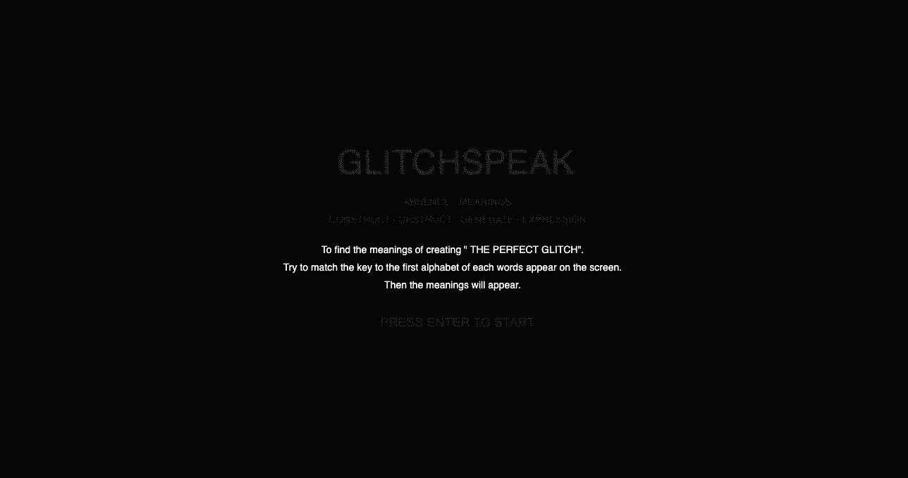

## Final Submission

## About the project.

[Play here](https://ptpeem.github.io/EdmCodeWorld/Final/GlitchSpeakGameLatest)

The game title is called “Glitchspeak” - logic game for reading.  This game is designed based on the text “Creating the “Perfect Glitch” using critical media aesthetic”, from the book called “The Glitch Moment (Um)” by Rosa Menkman. The chosen text describes what it is mean by “Glitchspeak”. This chapter illustrate the meanings of contructed and destructed glitch, also how it generates new meaning and expression. I have chosen to work with this text because I love the theory in which when glitch ruins, it generates new possibilities and new meaning arise.

## The purpose of the project.

Please click on the image, it will direct you to the youtube video of the final project that I have achieved in using “P5JS : The game logic for reading called "Glitchspeak"

The purpose of this Game is to encourage users to enjoy playing the game while also be able to learn the meanings from the chosen text. This game is designed for the users to match the right “Keys” of the first alphabet of each words display on the screen. If the users match the right keys before the new words display, they will be rewarded with the meanings of “Creating the perfect glitch using critical media aesthetic”. Else, if the users match the wrong keys. The meanings will not arise but error messages will be display. If the users match the keys wrong three times the game will over. 

## Reflecting to glitch-aesthetic theory

This game has incorporated glitch-aesthetic with an inspiration from Pachinko’s game style into the design. The game is reflecting to the original theory through the gameness, animations, randomness, colours, shapes, layout, layers and typography.  There are several steps that I used in order to create this game. First, understanding the text and took out the idea and style. Second, design the paper/digital prototypes. Third, created pseudo code, learning and experimenting with code. Fourth, building : creating object, animating text, develop player interaction, apply player feedback and improving user experience. 

## Learning resources

[
[
[
[
[

There are four main library that I used to learn about Javascript and create my game. First, processing in studio-time lectures by Andy and Karen. Second, Udemy online learning platform “Coding for visual learners : Learning JavaScript From Scatch’ - created by Engineerings Arslan. Third, Youtube : The coding train channel - created by Daniel Shiffman. Last, p5js.org/reference created by Lauren McCarth. I tried applied all the knowledges in javascripts that I learnt from the studio time and outside studio time into my game. For example, functions, operators, variables,  frameCount, conditionals, if/else block, keypressed, loop, random, return keyword, object methods, the “this” keyword, array, array.length, translate, push/pop, text adjustment, scale, alpha and map. 

## Application

[Instragram](https://www.instagram.com/matafakadesign/).
[Digital Portfolio](peemthaugsuban1.wixsite.com/mysite ).
[Linkin Profile](au.linkedin.com/in/peem-thaugsuban-8400aa149  ).

My background as a visual creators who passionate about communication design, graphic design, service design, typography design, packaging design and visual design. This project enable myself to develop my coding skills in order to create an artworks that is be able to communicate visually through digital. I could be to apply my design skills such as graphic design, typography design, animation design, user interaction design and experience design into this project and future project. The designers who is related to my practice is Alex Trochut who is an illustration and typographer. Alex role as a designer is to make the reading come first and pushing language to its limits with movement and dimension. I took this theory and try to make my game simple, functional but mainly focus on the logic of reading with some glitch-aesthetic. I also took Pachinko game design theory and applied it into my game. Pachinko mainly focusing  on visual stimulation, simple and variation is thematic.

## Reflection

Reflection of the outcome, Honestly I have not quite achieve what I want to achieve into this project. There are severals things that I want to adding into my game such as combine the game starting page, adding audio, add more visual (layout and effect ) into the meanings display page and fixing the bug. In some point the outcome is not achieve what as what I wanted to achieve from my plan but I am proud of myself that I have reached this for with coding because I am very new to code and I was a very tough and challenging time in this studio. 
