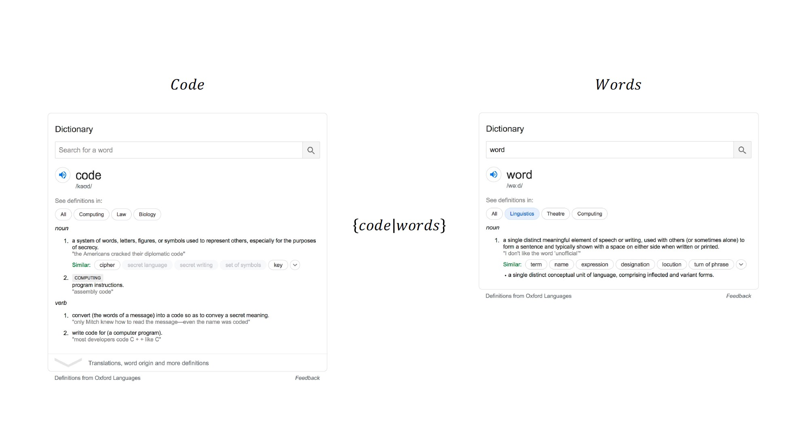
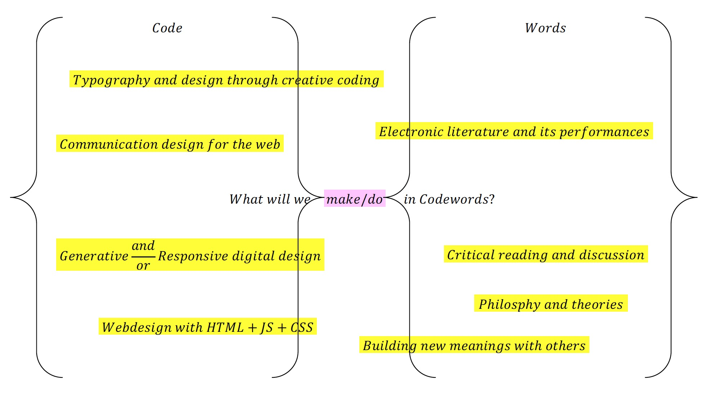
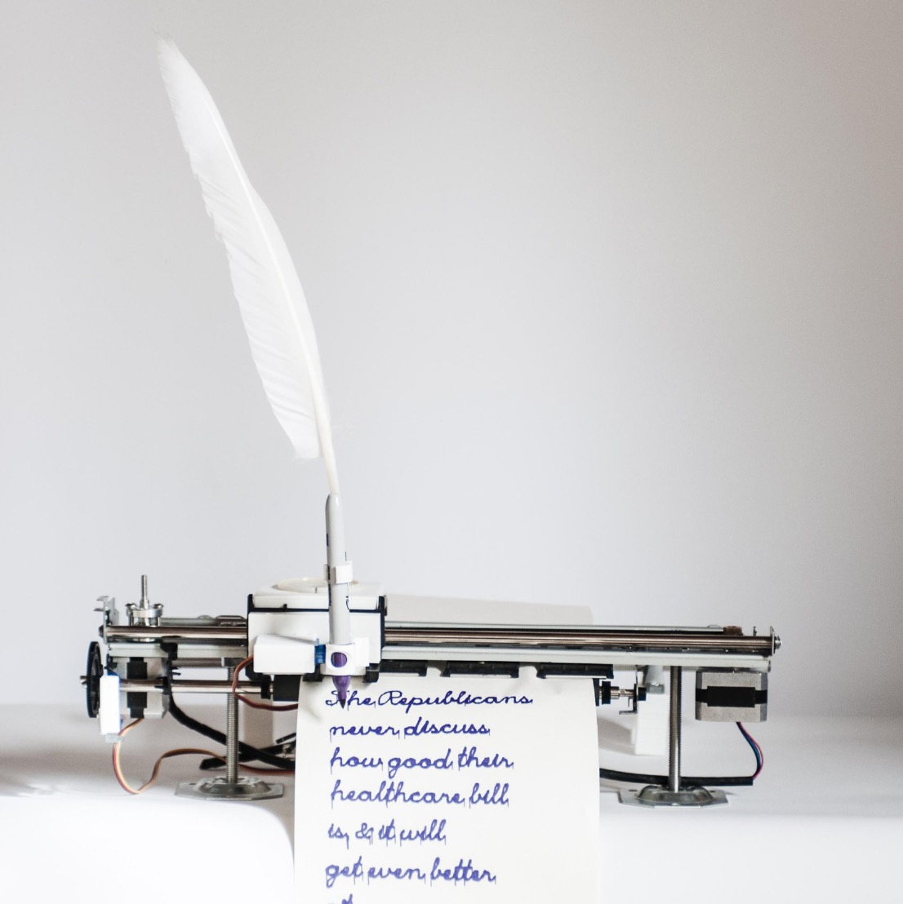
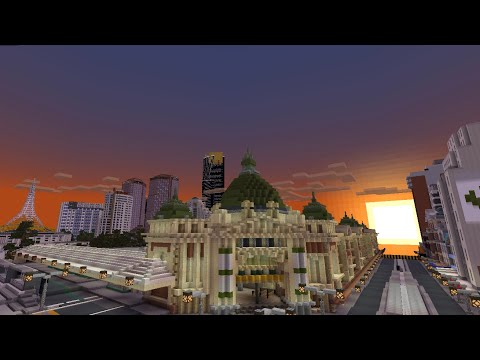

# Introduction

## What is Code

As an introduction to our studio, we were introduced to the definition of “Code & Word”

Code or a program instruction is define as system of words, letters, figures, or symbols to represent others, especially for the purposes of secrecy. 

Words is define as a single distinct meaningful element of speech or writing, used with others (or sometimes alone) to form a sentence and typically shown with a space on either side when written or printed.

## What we will make/do in our Studio?

 

This Image above demonstrate what we will do and aiming to achieve with Code & words in this studio. Apart Code & words, we will also learn how we will work together via virtual world environment. For example, In-class tutorial learning via platform called Collaborate Ultra which allows us for online sharing and learning such as coding with processing, reading, discussion and consultations. Apart from Collaborate Ultra, we also using other platforms such as Github, google slides, Canvas to keep us update, learning and sharing.

## How we learn ?

 

In this studio, we will learn how to work with code using the software called “ Processing “ designed by Casey Reas and Ben Fry. Processing is a flexible software sketchbook and a language for learning how to code within the context of the visual arts. Since 2001, Processing has promoted software literacy within the visual arts and visual literacy within technology. There are tens of thousands of students, artists, designers, researchers, and hobbyists who use Processing for learning and prototyping ( HTML, Java Script and P5js.

## What is code and words can do ?

 

We were introduced to one of Karen and Andy mechanisms project called “Trump of Swan”. This machine is a robotic-writing machine which automatically inscribes every tweet published from the Twitter account @realDonaldTrump onto a continuous roll of archival paper, using a custom-coded machine-cursive script. This machine controlled by code-instruction base system which mean when when twitter account @realDonaldTrump post something the machine will generate and write a word and sentences.

## Mine Craft : Virtual World learning and sharing !

 

We were introduced to Melbourne city via digital space created using Minecraft (well a virtual version of Melbourne). We were having discussion on hypertextuality, and how reading may be changing in digital space. The purpose is because we are going to be doing for our first project which is aim to work as a group in order to explore how reading is changing in virtual environments. Each group will be provided a short text to be interpreted through a performance in the popular online gaming environment ( Minecraft ).
