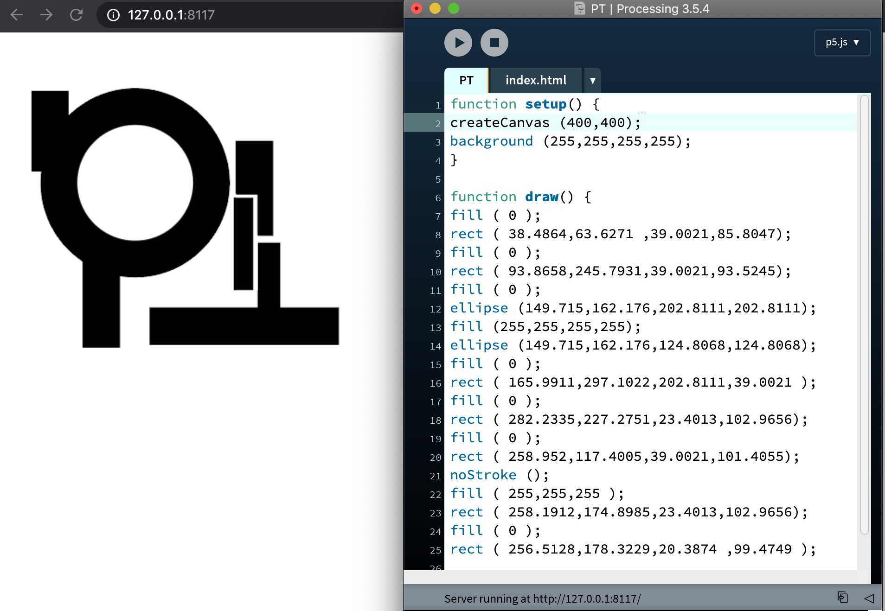
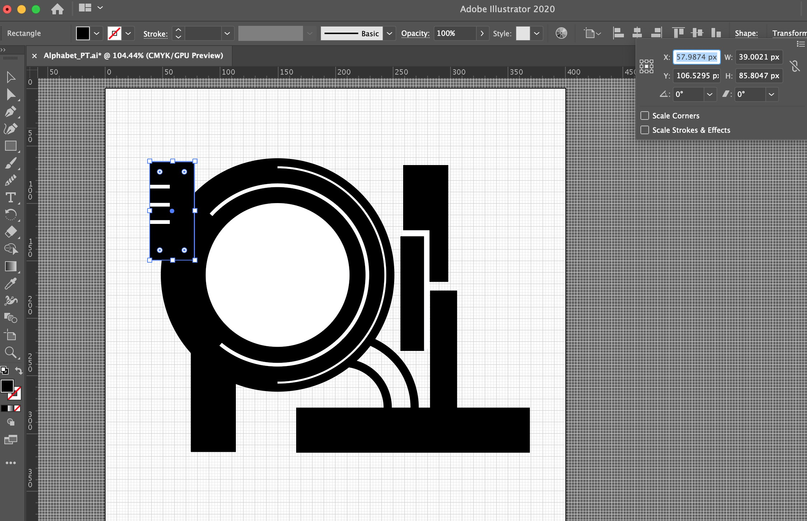
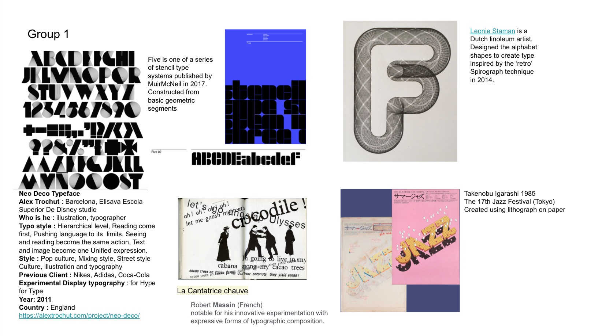
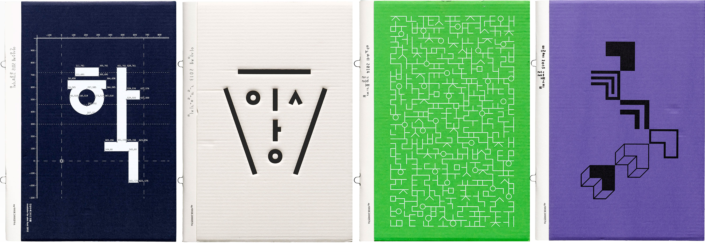
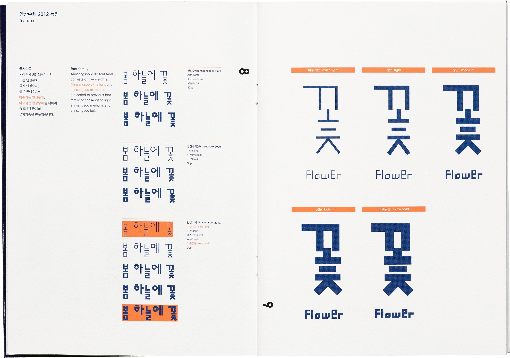
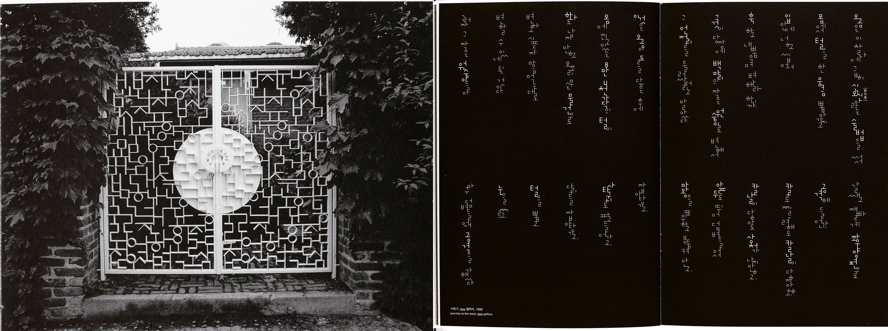
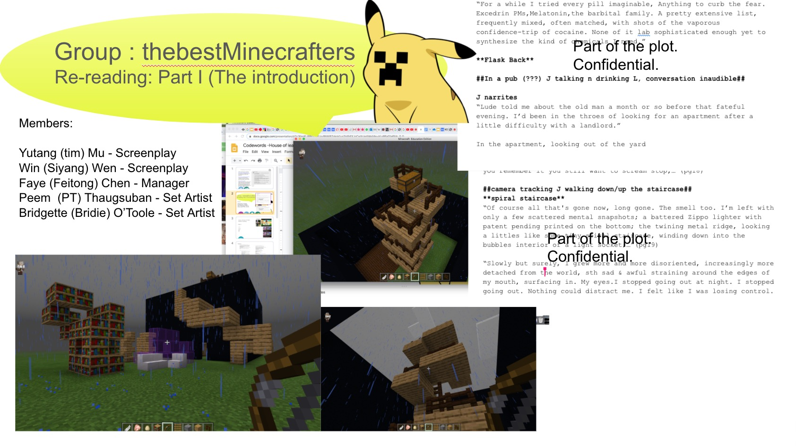

## Initials Alphabet using Processing

 

In the first week we have been assigned to make our first sketch using processing to create our initials. Our second class, we began with showing our homework that we created. The aims of this first sketch is to use only simple shapes, lines, and colours to construct alphabets of our name ( Or English equivalent ). I created initials alphabet for “PT” which stand for Peem Thaugsuban.

# Process

 

I first began my process by creating my alphabet in Adobe illustrator ( Grid turned-on ), with the canvas size of 400px x 400px (Canvas size we requires to do in processing). I draw alphabet with simple shapes, lines, and black colour in Adobe illustrator. I then found the x and y value of each shapes and lines that I draw and pasted them when I did the coding in processing. This way helps me to positioned all my elements that I created in Adobe illustrator to be position at the same style, size and place in processing.

## Lecture and discussion

We began the showcased about modular typeface from the Bauhaus to contemporary designers working in “Algorithmic typography” or also know as “Parametric typography”. So, what is Algorithmic typography? It is a mathematician comes up with a set of formulae that define attributes for the whole batch. Parametric typography can be use to create a desired effect, or just apply them to an alphabet and sees what happens, and the resulting uses range from the utilitarian to the bizarre

## Research 

We began our research on our favourite typographer that we think that he/she is design a typeface that related/similar to algorithmic typography category. At first I picked to do a research on Alex Trochut and my favourite type from him is “ Neo Deco Typeface” as presented on the image above.

## What does Algorithmic typography really look like ?

One of the example of typographer chosen from Algorithmic typography lecture video is Ahn Sang Soo.

Ahn Sang Soo is often recognized as the father of contemporary Korean type design, and for good reason his typeface is present as one of Algorithmic typography. His first typeface designed in 1985 broke the molds of Hangul’s traditional design and paved a path of experimentation for the young script. The new version that Ahn developed from the traditional type look very modern and natural that inspired from Hangul’s philosophy and construction.

“Ahn played with how letterforms interact, whether by elongating connecting lines between characters, breaking them apart with empty space or treating individual letters as purely graphic elements. He broke from tradition but also drew from it to create a new paradigm in Korean typography,”

One of the typeface that Ahn created called “ Mano “ which the image show that Mona is in use demonstrate how Ahn’s typeface are also a graphic medium. On the left Mano typeface is use for Hangul gate in Pyeong-Change, Seoul, 2000. On the right Mano typeface is use as a composition for journey to the west, Ginza graphic gallery, 1999.

## Our progress on the second project 

As mentioned previously in the first week that we have to explore how reading is changing in virtual environments. The reading that we were assigned to work on called “The House Of Leaves”. This book is a debut novel by American author Mark Z. Danielewski, published in March 2000 by Pantheon Books. The chapter that my group chosen to work on is the “Introduction Part” of this book. We chosen to use Minecraft as our digital space to show “how this reading is changing in virtual environments”.

The image above show the progress of what did we do during the week for this project. What we did is pretty much reading and try to understand the story of the “Introduction part”. From there, we created a google doc. to noted down what key informations or important plots that each one of us in the group took out from the book. 

