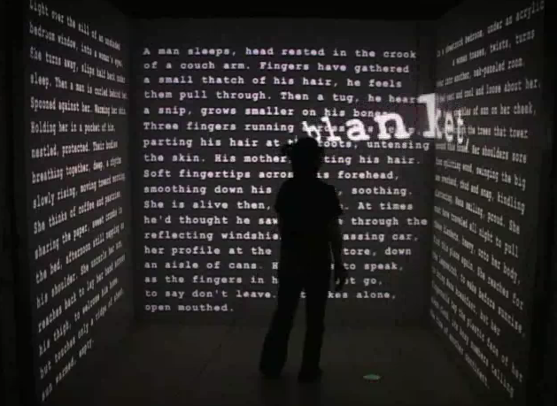
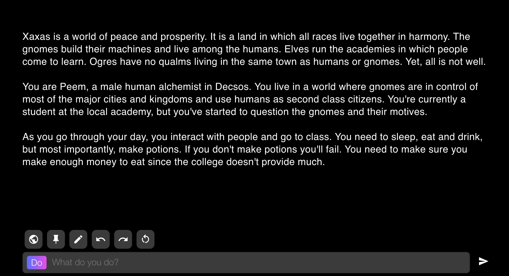
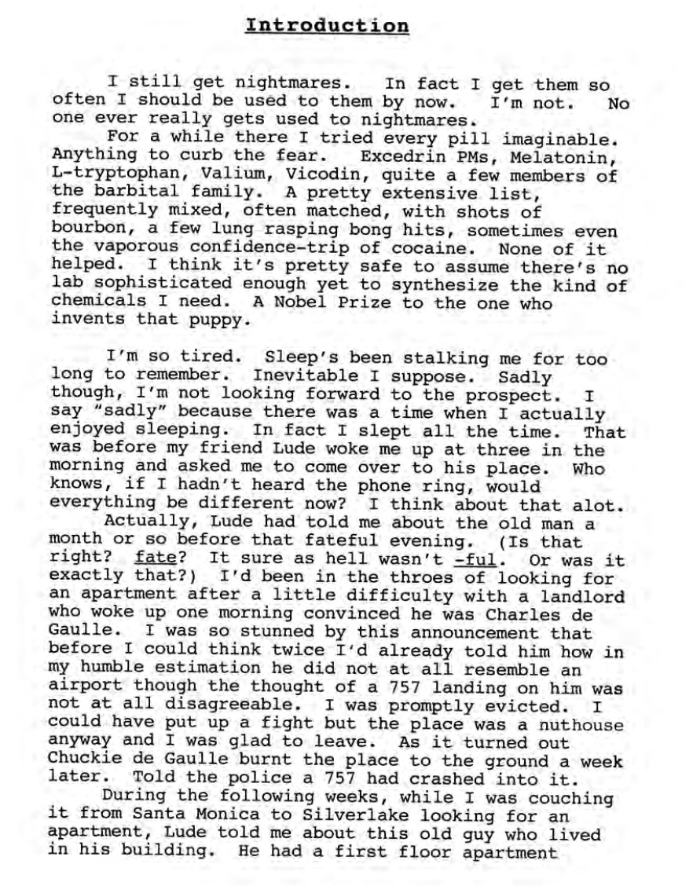
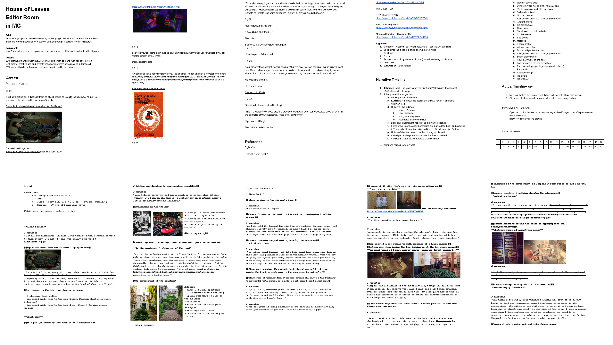
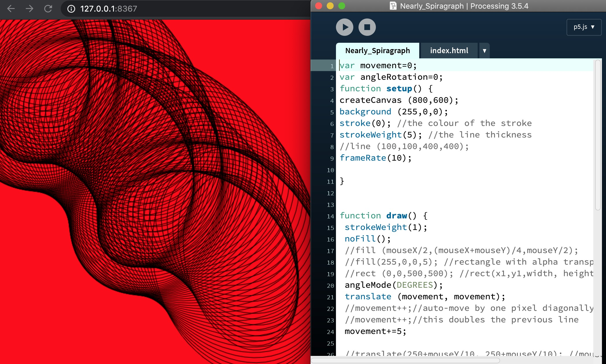

## Virtual Identities 

Please click on the image, it will direct you to the youtube video for case-studies on avatars and virtual identities

At the begin of session, we were introduce to what is mean by virtual identities? It is mean a part of an interface that represents the user in a virtual world such as a chat room, video game, or virtual common space. There a different type of virtual identities which are built to complement various platform and virtual spaces. It is commonly used in video games or virtual space which called “ Avatars” and each avatar often provide with a name, profiles and information about the avatar. Virtual space will more or less represent the actual physical or stories reflecting on the identity of the user or avatar. 

 

We also been introduced to Electronic Literature. It is something that is created digitally and is meant to be viewed digitally. Electronic Literature is generally considered to exclude print literature that has been digitalized. Therefore, a book that is originally in print form but is transformed into an e-book is NOT an example of Electronic Literature.What makes Electronic Literature different from other types of literature is that it is able to incorporate digital elements (such as photos, music etc.) along with the text, which creates an interactive experience for the reader.

 

Throughout the class we interacted and created our own narrative in AI Dungeon, I joined the Xaxas which is a world of peace and prosperity. It is a land in which all races live together in harmony. The gnomes build their machines and live among the humans. Elves run the academies in which people come to learn. Ogres have no qualms living in the same town as humans or gnomes.

## Assignment Two

Brief Story about “ Introduction Chapter” : This chapter reveals the nature in which Johnny and Lude encountered Will Navidson's work. Apparently, a man named Zampano passed away in a lonely apartment. The apartment was in Lude's building. Johnny is called by Lude early one morning to come and take a look at something. After he takes a look, he leaves with the old man's black trunk. It is filled with writing (the Navidson story). Johnny starts putting it all together and becomes obsessed with this chore.

As a group, we created a Goole Doc and shared for everyone and make contribution toward this assignment two. This google document is our “Plan” for this project which contains all the information, context, script, scene, tasks and images. It is a guideline to draft our project of what are we going present, achieve and the outcome going to look like. At first, we discussed about the brief and what we need to produce. Second, we tried to understand the story and took all the necessary information or the main plots/scenes from “Introduction Chapter” and put on the Google Doc. Third, we cut-down the informations and tried to create/build out the scene from those significant information that we have after cut down. Fourth, we found the cinematic references from movies and internet to present the scene that we have. Lastly, we separated the task of who is going to be responsible for which part.

To find out more about our First_Plan please visit this link :

[BestMincraft_Scrip&Plant](https://docs.google.com/document/d/1WgoUWJ-hBFhOqOPKxN4vSNMM6sSR0MrueVGS22FdW4c/edit#).

## In class Processing

[Play here](https://ptpeem.github.io/EdmCodeWorld/Week_03/Nearly_Spiragraph/)

After we the Week_02 that we were practicing how to draw simple; shapes and lines. This week we were having discussion about how can to draw something with simple lines and movement. We then came up with an idea of how to draw something close to a spirograph. At the end we create something which we called it “Nearly Spirograph” using the command such as var movement/ var angleRotation, translate and rotate.
