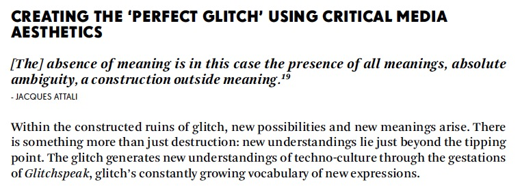
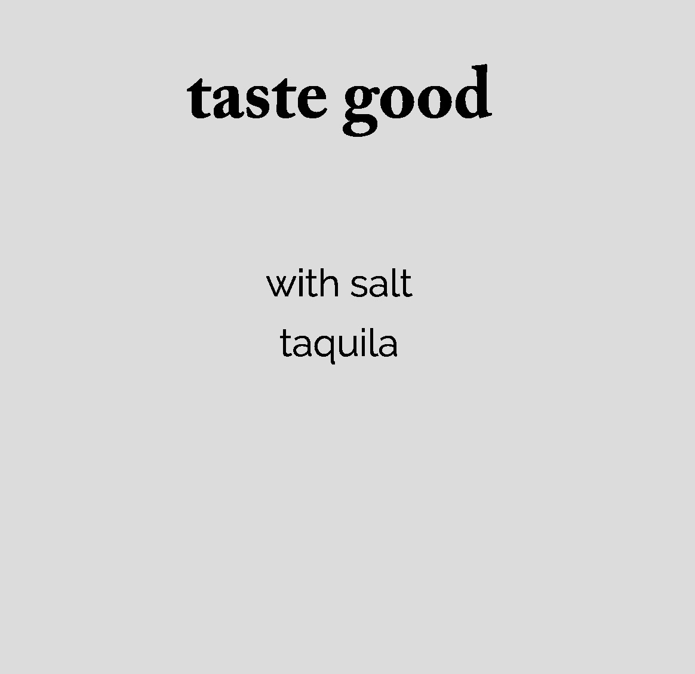

## Assignment 2 : Plan with Storyboard ( Progress )

Please click on the image, it will direct you to the youtube video of the teaser ( Pre-screening ) of our Task 2 project.

This week we were required to present a teaser ( Pre-screening ) for our Task 2 project “ House of leave: Introduction “. The purpose of this is to get feedback and advice from our peers and lecturers before submitting the final outcome in the mid-night. Our group we were presenting a horror and creepy atmosphere through the use of music, sound effect, long shots, close up, fast cut, scenery shot and montage.

Honestly, I am much appreciated with all the efforts that everyone in the group has put into this assignment. We had a group chat on Facebook that we use it for discussion and update all the progress to each others. I called this group “ The best Minecrafters” because everyone were willing to help, participate, discuss and make changes toward what every we agreed or disagreed with. The outcome is very successful and we all received High Distinction for this project. Again, I would like to Thank you to everyone for this contribution and fun experience to work together as group.

Please click on the image, it will direct you to the youtube video the final releases of “House of Leaves Book | Introduction Part | interpreted in Minecraft”

Directed, constructed and produced by “The best mine crafter” : Yutang Mu, Siyang Wen, Feitong Faye, Bridie O’Toole and Peem Thaugsuban

## In class - Major Project

.jpg)

In class, we were introduced to our Major Project. In this assessment task we will research, develop, code and publish a digital version of a critical text on art and language. Our final deliverable for this task is a website (github) URL of your published project, but there are some steps (milestones) along the way which you need to complete before you can deliver your project. This assessment task is made up of four distinct milestones. At each stage you will be provided with an ongoing assessment and feedback. This process is intended to provide us with the most opportunities to develop a complex and rich project outcome. 

## In class - Chosen Text

_Group.jpg)

At the beginning of the session, we introduced to different texts that we have to choose. We have to choose one text of critical theory on language and new media. We were working in small groups to make summaries of many of the texts to help us make our choice. The book that I have chosen to work with called “ The Glitch Moment (um)” by Rosa Menkman, 2011”

To find out more about the summaries of texts, please visit this link (“ The Glitch Moment (um)” - slide no.6) :

[The summaries of our texts](https://docs.google.com/presentation/d/1tF9j3J75aVpLWOs6R_vCNQty8WjL-_AfgO9TgyKLoq0/edit#slide=id.g91a5b1fc32_17_0).

## Chosen text - The Glitch Moment (um)” by Rosa Menkman, 2011

Please click on the image, it will direct you to the youtube video that I have studied about  “Glitch - Benchmarking the deranged: Rosa Menkman”

The reason I like about this text is because, I like how glitch practices and theory can generate awareness through technically, culturally, critically,aesthetically and finally as genre. Glitch makes sense differently in terms of noise, failure and accident which can also be use to shown in different contexts such as political and social uses. 

I chosen the informations in the topic of “ Creating the perfect glitch using critical media aesthetics “ to work with for my Major project. There are two passages that I love about this topic

The key passage no.1  is “Within the constructed ruins of glitch, new possibilities and new meaning arise. There is something more than just destruction: new understandings lie just beyond the tipping point. The glitch generates new understanding of techno-culture through the gestations of Glitchspeak, glitch’s constantly growing vocabulary of new expressions.” 

The key passage no.2 is “The absence of meaning its in this case the presence of all meanings, absolute ambiguity, a construction outside meaning”.

## Processing : Importing text

[Play here](https://ptpeem.github.io/EdmCodeWorld/Week_05/Typetest/)

In class, we learnt how to importing text and create some adjustment. The adjustment that we learnt in this class were thing such text size, fonts and text align.
