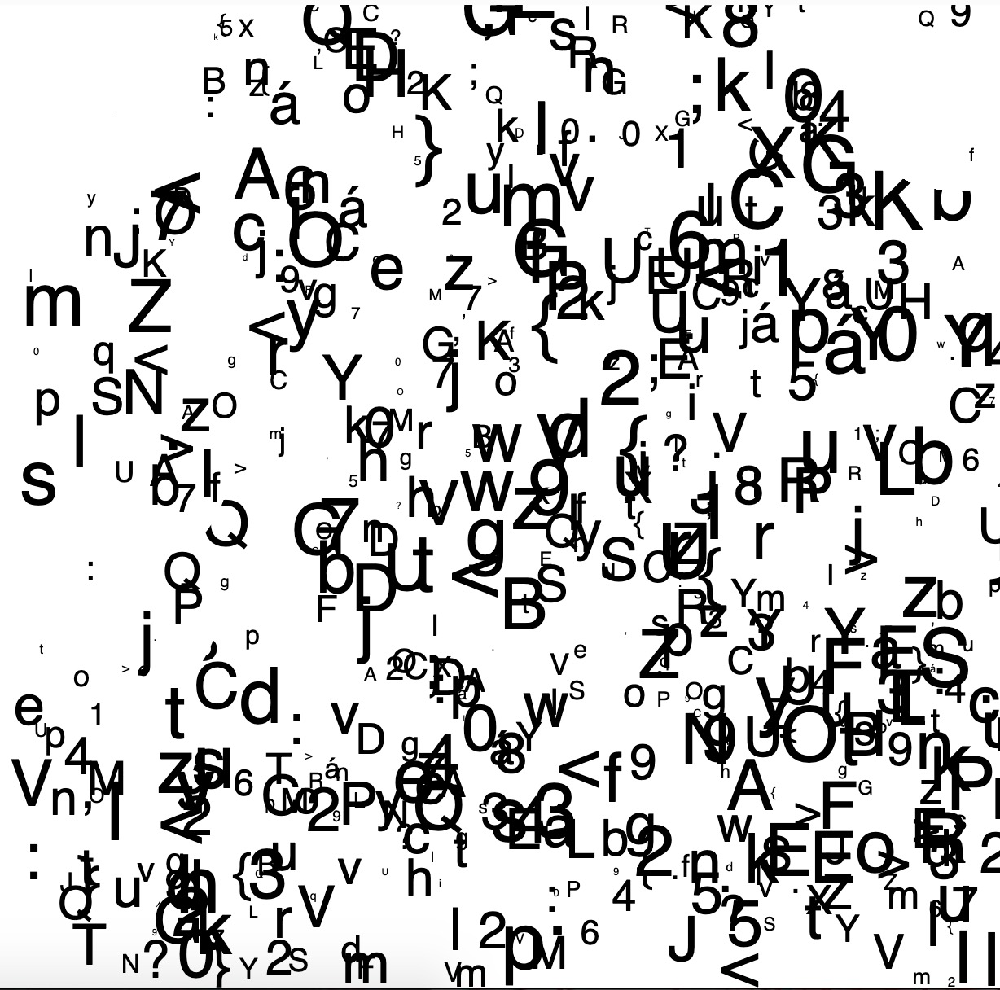
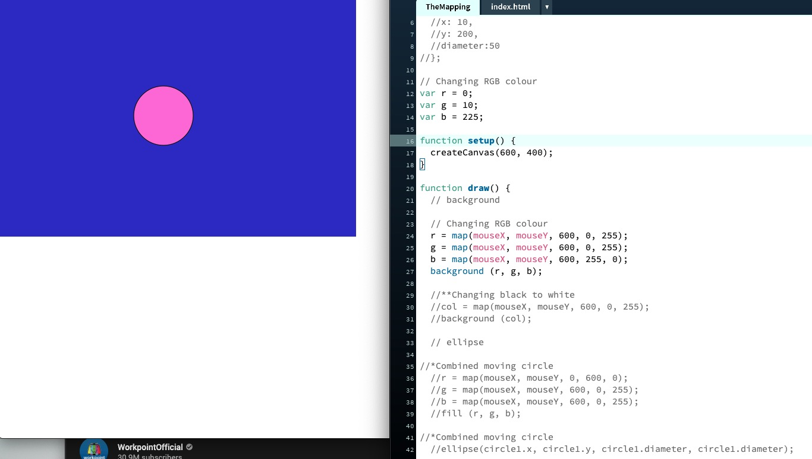
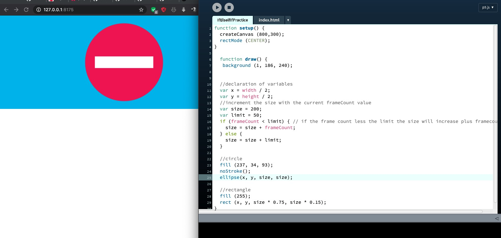

## Group Activity.

As in a group, we were practiced making and using paper-prototypes of popular retro 2D video-games in a group. I picked the 2D space shooting game and tried to make the paper-prototype out from it. It was very activity because I was be able to break down how the game is functioning into a slower-motion by using GIF. After, we finished with the paper-prototype. We were were also developing some pseudo-code from our daily habits. At first, I was very confused about what is pseudo-code and what it means. After, Andy and Karen used daily live activity as an example, it makes things become clearer and simple.

## Processing : Random text.

[Play here](https://ptpeem.github.io/EdmCodeWorld/Week_06/TextRandom/)

In the Processing studio-time, we learnt about how to use large body of text to create random type-animation. It was a very fun processing-class because I was be able to code some random text “a-z” to appeared on the screen. Also, when the mouse moved it erases those random texts display on the screen.

## Processing : The mapping Practice.

[Play here](https://ptpeem.github.io/EdmCodeWorld/Week_06/TheMapping/)

This week, I was spending time learning about “ Mapping Function “. I was experimenting with this exercise above. The outcome that I have received here is when the circle move around  x and y position, the colours of the background will also changes it colours base on the ranges of colours that I input.

## Processing : Pseudo-Code

[Play here](https://ptpeem.github.io/EdmCodeWorld/Week_06/IfElseifIfPractice/)

In order to understand more about pseudo-code that Karen and Andy have introduced it to us. I was spending time experiment with pseudo-code and created some little circle animation using If, else. 

  
<a href='https://ptpeem.github.io/EdmCodeWorld/Week_06'> <-- Last Week / Pseudo Code</a> | <a href='https://ptpeem.github.io/EdmCodeWorld/Week_07/'> Next Week / Game Logic For Reading --></a>

