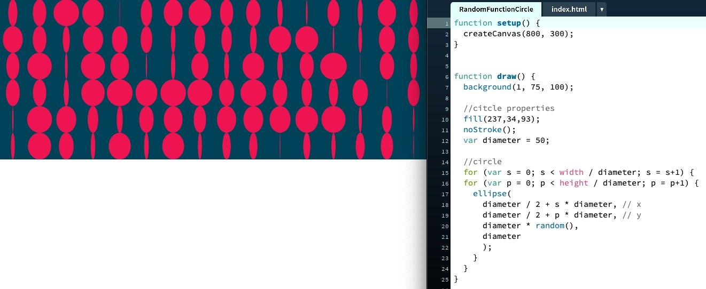

## Paper-Prototype ( Option 1 ).

This is the first paper-prototype that I have created with the use of typographic layout. Honestly, at first I was a bit lot with what am I going to do for my major project and o misunderstood of the my text. This paper-prototype, I used typographic to represent “CodeWord”. I was planing to use “Glitching Effect” as the theme as well as incorporating technological design to represent the content of my text. Also, representing some pop-culture through the use of colors. But the feedback that I got from Andy for my first prototype  was “ Glitch is actually the unpredictable result which by definition we can’t plan.

[First paper-protoype](https://docs.google.com/presentation/d/1dX_ZDAdoo_U-JSXTtUxhwClVBWJZjEu7X48fx6t4-Zc/edit#slide=id.g980079f83c_6_10).

## Paper-Prototype ( Option 2 ).

After I have received the feedbacks from Andy and peers. During the week, I was spending time to re-think and refine my new concept. I then came up with this Game logic for reading. The purpose of this game ramifying reading is to help the user to find the meanings of creating "THE PERFECT GLITCH"  with the glitch-aesthetic. The game works by if the users try to match the key to the first alphabet of each words appear on the screen and then the meanings of creating a perfect glitch will appear.If the users “Match” the first Alphabet of each word display screen the meanings will appear.Else, if the users match the wrong keys the result will be something else. To find out about the chosen text, key message, concept and pseudocode please see the link below.

[Second paper-protoype](https://docs.google.com/presentation/d/1dX_ZDAdoo_U-JSXTtUxhwClVBWJZjEu7X48fx6t4-Zc/edit#slide=id.ga0301ed005_0_0).

## Processing : Loop and Loop Nested.

[Play here](https://ptpeem.github.io/EdmCodeWorld/Week_07/LoopNLoopnested/)

During the week, I created some simple circles exercise to practiced and learn more on how the “Loop and Loop nested” is working.  The loop function allow the coders to execute a block of code over and over again. Bt trying to writing code and get my hand dirty was very fun and it does helps me to understand more about each function and keys in order to write codes in more dept.

## Processing : Random function.

[Play here](https://ptpeem.github.io/EdmCodeWorld/Week_07/RandomFunctionNumber/)

[Play here](https://ptpeem.github.io/EdmCodeWorld/Week_07/RandomFunctionCircle/)

This week, I was spending time learning about “Random Function”. This function helps to generates a random number overtimes it’s called.  By default the number generated is in between 0 and 1. The random(Number), generates a random number in between 0 and the given number. The random (min, max), generates a random number in between the minimum and maximum given numbers. I did experiment with both numbers and shape in order to understand how the Random Function is work.

## Processing : Noise function.

[Play here](https://ptpeem.github.io/EdmCodeWorld/Week_07/LoopNestedLoopNoise/)

I was also learning about the Noise function for this week. The noise (input) provided a sequential input, it creates random values that has a much more smooth transition. In this exercise, I used my previous sketch “RandomFunctionCircle “ for experiment. Applying the noise function to this sketch allow the my animation to become more organic-looking and different for each circle.
