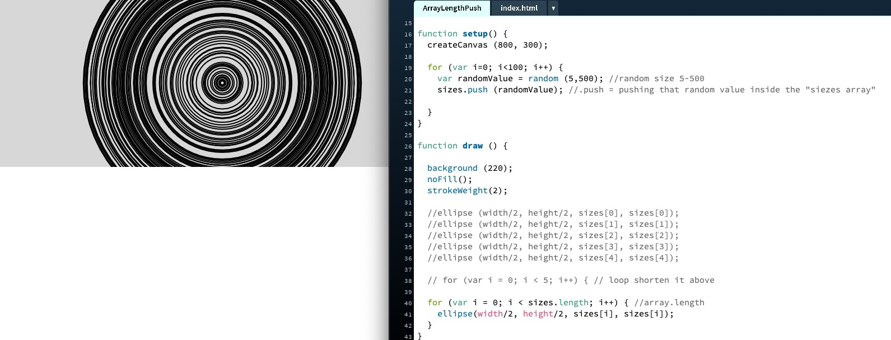
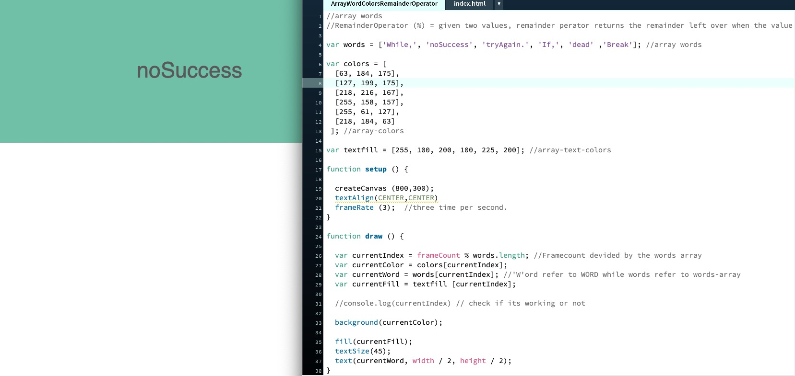
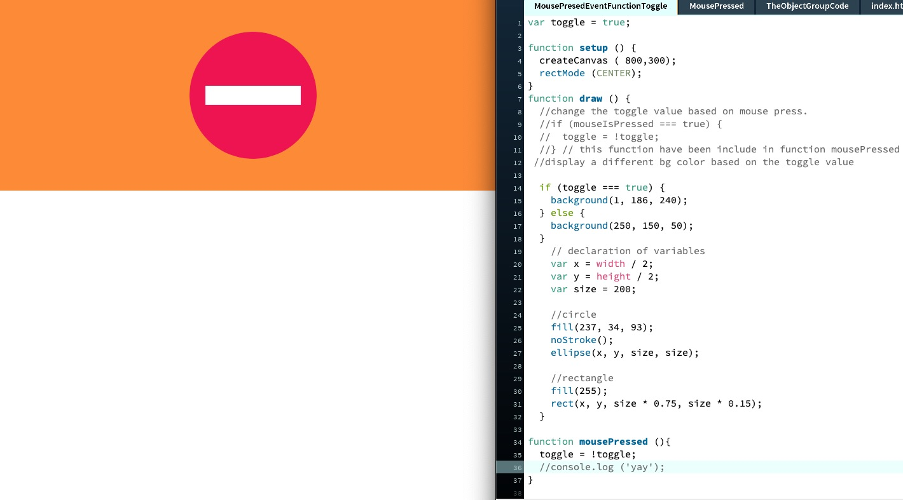
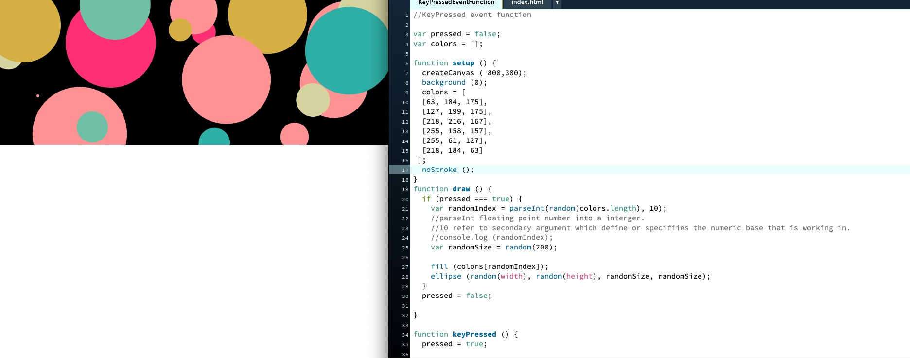

## Paper-Prototype ( Option 2 ).

After last week that I have received the feedbacks from Andy and peers. During this week, I was spending time to re-think and refine my new concept. I then came up with this Game logic for reading. The purpose of this game ramifying reading is to help the user to find the meanings of creating "THE PERFECT GLITCH"  with the glitch-aesthetic. The game works by if the users try to match the key to the first alphabet of each words appear on the screen and then the meanings of creating a perfect glitch will appear.If the users “Match” the first Alphabet of each word display screen the meanings will appear.Else, if the users match the wrong keys the result will be something else. To find out about the chosen text, key message, concept and pseudocode please see the link below.

[Second paper-protoype](https://docs.google.com/presentation/d/1dX_ZDAdoo_U-JSXTtUxhwClVBWJZjEu7X48fx6t4-Zc/edit#slide=id.ga0301ed005_0_0).

## Processing : Array : array.length and array.push

[Play here](https://ptpeem.github.io/EdmCodeWorld/Week_08/ArrayLengthPush/)

During the week, I was experimenting with Array function. Arrays are sequential collection of data that are stored with a numbered index. This also can be create an an empty array by using square brackets. The Array.length  is mean to includes all the 'values' inside the array. The length is array (and a string) property that returns the number of items in an array (or a string). The Array.push is mean to pushing the value inside the array.

## Processing : Remainder Operator (%).

[Play here](https://ptpeem.github.io/EdmCodeWorld/Week_08/ArrayWordColorsRemainderOperator/)

[Play here](https://ptpeem.github.io/EdmCodeWorld/Week_07/RandomFunctionCircle/)

This week, I was also experimenting with “Remainder Operator (%)”. This function is mean to given the two values, remainder operator return the remainder left over when the value on the first value on the left is divided by the second value on the right. I was experimenting with displaying the words on the screen instead of the index numbers and as well as changing background colours base on the input in the array. 

## Processing : MousePressed Event Function.

[Play here](https://ptpeem.github.io/EdmCodeWorld/Week_08/MousePresedEventFunctionToggle/)

I also learnt more about MouselsPressed which is the variable that gets the value true when the mouse is clicked on the canvas area and false for every other time. I used my previous sketch that created earlier to practice this function. The outcome that I got here is when the mouse is pressed and the background color will change from blue to orange. 

[Play here](https://ptpeem.github.io/EdmCodeWorld/Week_08/KeyPressedEventFunction/)

I was also practicing with KeyPressed function which is the event function that gets called overtimes when a key is pressed. The out come that I got from this exercise is when any key is pressed, it will create random colours-circle on the screen.
