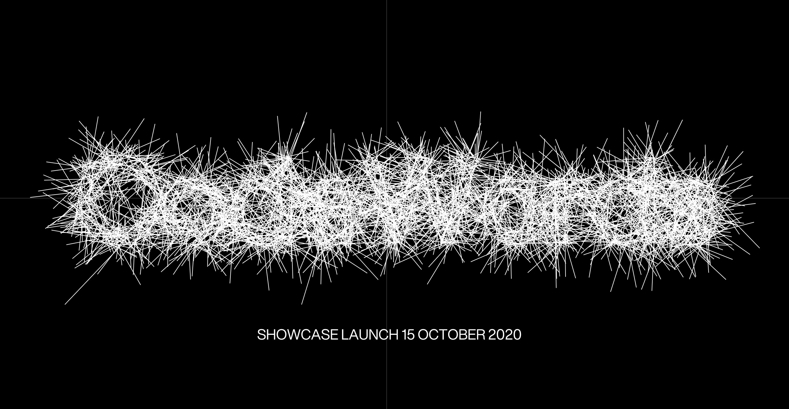
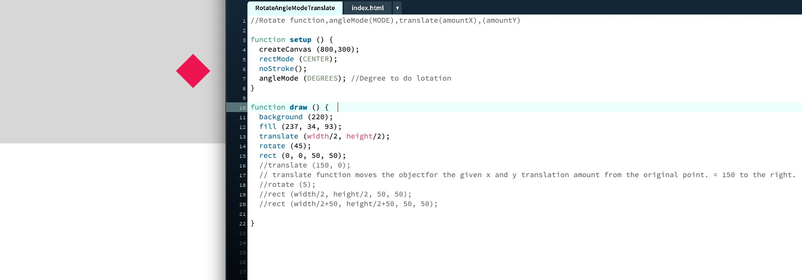
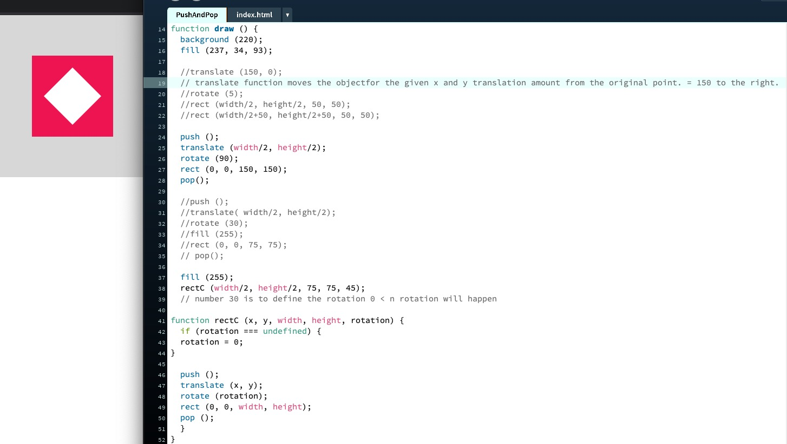
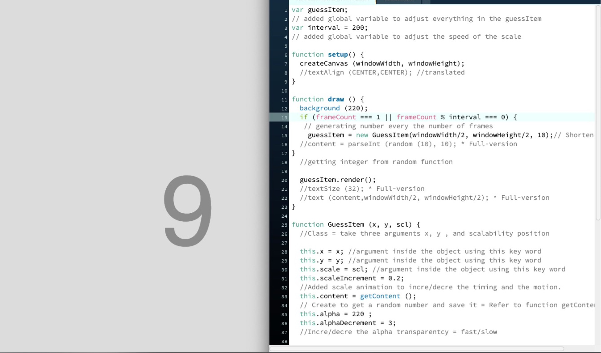
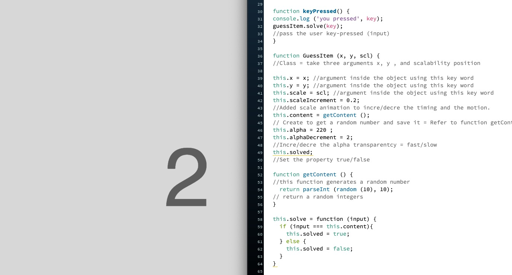

## Showcase

We started discussing how to gather all of our projects into an online exhibition. Here is where we will likely host the showcase

[Showcase](https://simandy.github.io/codewords/).

## Virtual World : Working environment

Andy and Karen supplied us the Google sheets for us to update everything for this major project which includes our selected texts, progress and requests for help.

[GoogleSheet](https://docs.google.com/spreadsheets/d/1rqOlmfpCzXC9kA_vBeLOcTpdxCvWeo4zsiNa4uiDHTY/edit#gid=0).

## Processing : Learnings

## Transformation Function

[Play here](https://ptpeem.github.io/EdmCodeWorld/Week_09/RotateAngleModeTranslate/)

This week, I was learning about transformation functions in p5js such as rotate, angle mode, translate and scale. The rate function rotates the entire drawing area by the given amount. The angleMode function sets the unit for angles. The default unit it radians. This can be change to degree by passing the viable degrees. The translate (x,y) function translates the entire drawing area by the given X and Y amount.

## Push & Pop Function

[Play here](https://ptpeem.github.io/EdmCodeWorld/Week_09/PushAndPop/)

I was also doing some exercise to understand more about Push&Pop function. The “Push” creates a new state while “Pop” restores the state that is created by the previous push function. These two functions are used together. I did some experiment on the previous sketch that I have learnt about rotate and translate and applied them into the push and pop function.

## Major Coding Project - Progress.

## Random number with animation, motion and alpha.

[Play here](https://ptpeem.github.io/EdmCodeWorld/Week_09/RandomNumberAnimation/)

During this week, I was experimenting with generate random integers ( 1-10 ) to randomly appear on the screen with some little animations. I also played around with the speed of the motion, scale and apply alpha effect into this first step toward my final outcome. I did commented all the details in my code please visit my code here to understand more about what I did.

## User Interaction - Key pressed

[Play here](https://ptpeem.github.io/EdmCodeWorld/Week_09/InteractionUsersPressed/)

I also applied some user interaction on the sketch for this week. This allow the user to press the keys and when the user pressed the ( any keys ) the text will be gan to display. This is going to be the second step that I am making toward my final outcome.

  
<a href='https://ptpeem.github.io/EdmCodeWorld/Week_08'> <-- Last Week / Paper Prototype</a> | <a href='https://ptpeem.github.io/EdmCodeWorld/Week_10/'> Next Week / User Feedback --></a>

