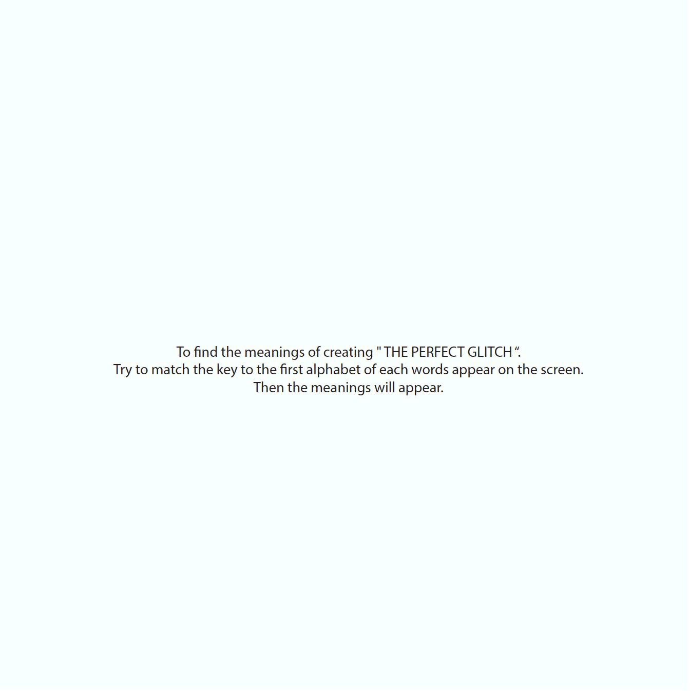
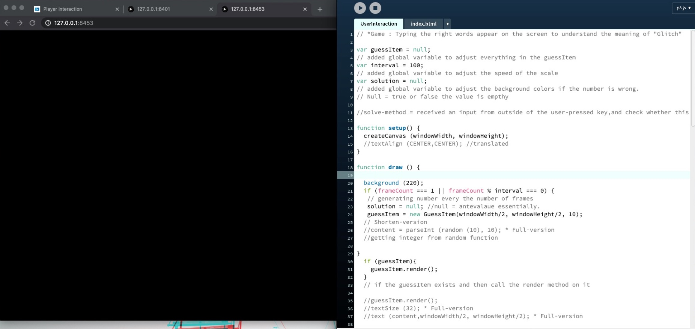
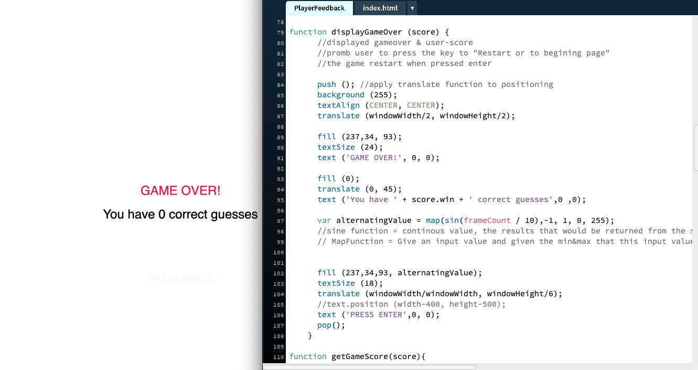

## Major Coding Project - Progress.

## Game Plan

This week, I have step-back and did some prototype for my game. This prototype I was experimenting on how to make the “Chosen Text” become more stand-out, improving the flow and communicate the message that I am trying to deliver in my game. I was experimenting with the layout to display the messages. For example, if the users match the right key of the first alphabet display on the screen. How/where the meanings will be display on the screen so that the users can read while playing the game. I was very struggled because I do have a lot of idea to play with but since my coding skill is very basic then the limitation is there and I was worrying whether will I be able to achieve the outcome that I want to achieve or not. “ The pain is real”.

## User Interaction.

[Play here](https://ptpeem.github.io/EdmCodeWorld/Week_10/UserInteraction/)

During this week, I was trying to add some users interaction to my game. The progress that happening here is when the users press the key that is not match to the number on the screen then the black screen will display. I made an adjustment in the Function keyPressed in order to make the game functional. Also, I applied push and pop to make it easier to make more adjustments. It was very challenging to experiment with this because it involved a lot of thinking back and forward plus a lot of learning from tutorial from YouTube.

## User Feedback.

[Play here](https://ptpeem.github.io/EdmCodeWorld/Week_10/PlayerFeedback/)

I also made a progress on my game by adding some game over display screen. This means when users match the key wrong number of time then the game will over. The GameOver display screen will show the total score the the users have match right. If the users would like to try to play the game again I have applied the key “Enter to restart” which mean when this GameOver page appear and when the users press enter the game will restart again. 

