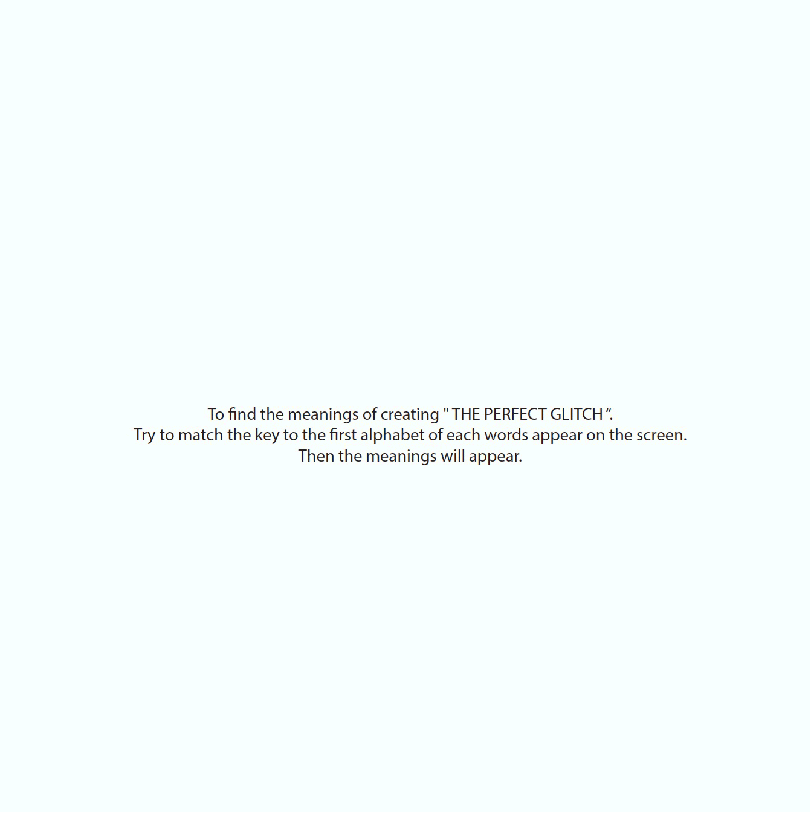
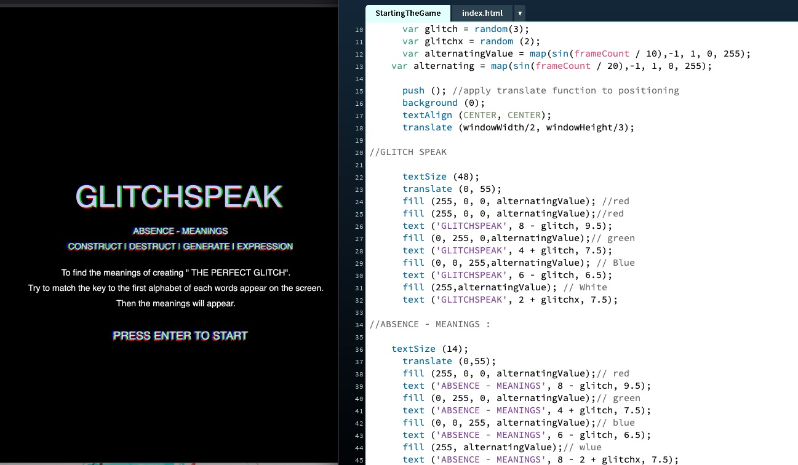
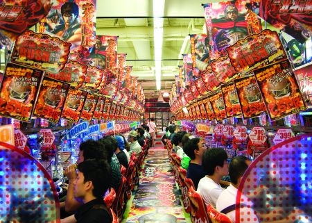
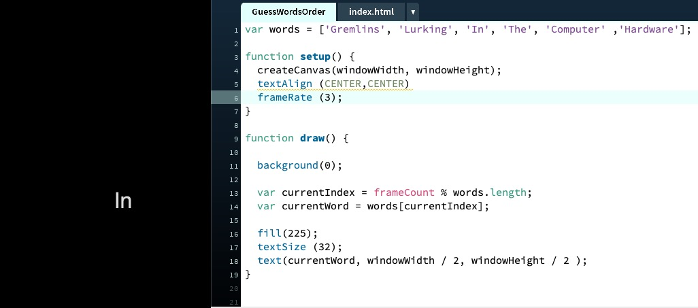
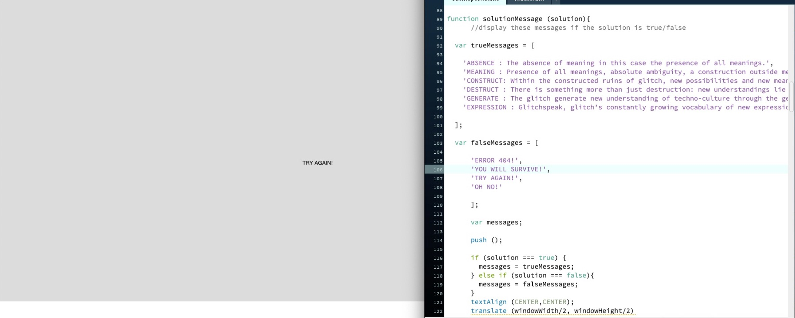

## Major Coding Project - Progress.

## Game Plan

After the consultation with Andy about my game “ Logic For reading and understanding the meaning from the text”. The feedback that I received was that the original text seems secondary and it does not jump out as much. I then did play around with my new prototype for my game. I was experimenting with the layout to display the messages. For example, if the users match the right key of the first alphabet display on the screen. How/where the meanings will be display on the screen so that the users can read while playing the game. I played around with the layout of the “ Meanings and Words” to make it look more functional and playful. I have decided to try to make a starting game display page as well so that when the user press the key “Enter” the game will start and when the “Gameover page “ display and users press “Enter” it will return to the “StartingGamePage” instead of directly jumping into the game. What I am trying to do here is make the game more obvious and bring out the original theory. But honestly, I am not too sure how to make it functional and receiving the outcome that I do want to achieve by using code.

## StartingTheGame ( Page Design ).

[Play here](https://ptpeem.github.io/EdmCodeWorld/Week_11/StartingTheGame)

Here is the StartingTheGame page that I created. I did some experiment with the design by applied the glitch-aesthetic into the game to it suitable to original theory and as well as to indicate the Gameness. Andy has suggested to me look up at the game from Tokyo called “ Pachinko “ Game and try to bring the game principle from Pachinko and apply it into my game.

## Pachinko in Japan : Research

Key principle in designing Pachinko Game which make the game become so popular and lucrative : Constant audiovisual stimulation, simple, universal controls, variation is thematic, mot mechanical, reiteration lowers costs and development time and small but reliable payments. 

[Pachinko](https://www.gamasutra.com/view/news/282680/5_lessons_game_devs_can_learn_from_the_continued_success_of_pachinko.php).

## GuessWordsOrder

[Play here](https://ptpeem.github.io/EdmCodeWorld/Week_11/GuessWordsOrder/)

Instead of generate random number for the users to watch what I was trying to do here is generate words in order instead. The sequence that I am trying to create here is GLITCH = Stand for ( Gremlins, Lurking, In, The, Computer , Hardware ). The purpose of this is for the users to try to match the first alphabet of each words display on the screen ( G, L, I, T, C, H ) instead of matching the numbers as the keys.

## Project : Progress

[Play here](https://ptpeem.github.io/EdmCodeWorld/Week_11/GlitchSpeakGame/)

This is the outcome that I could achieved for this week. I was be able to make the Guess words appear in the sequence that I want them to be ( Gremlins, Lurking, In, The, Computer , Hardware ). I applied glitch-aesthetic to the GameScore page with some animation. The struggled that I am facing here is I still unable to change the key from integers to be the alphabets just yet ( G, L, I, T, C, H ). I have been trying to put in the texts so when the users match the right key then the meanings will appear on the screen. Right now the meaning for the true message is there but still random. I need to find a way to make it appear on the screen like what I am aiming to achieve like on the prototype that I have created. 

