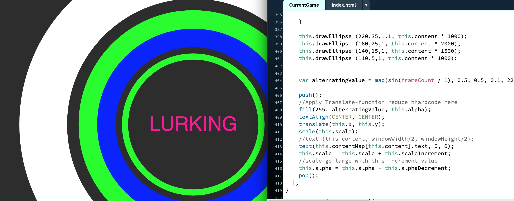
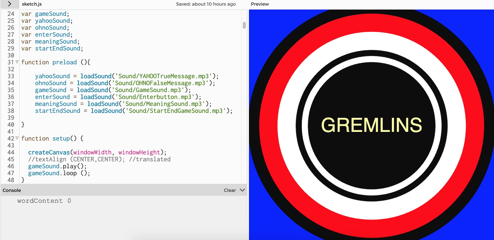

This is what I have archive so far this week with my game logic for reading before the submission.

##  Indicate Gameness : UI development reflecting back to Glitch Theory ( Randomly, unexpected )

[Play here](https://ptpeem.github.io/EdmCodeWorld/Week_12/GlitchSpeakGameLatest)

After the consultation with Andy about my game. He has mentioned to me to develop the UI of my Game. I took the feedbacks and did more research on Pachinko Game and I tried to apply the style of it into my game. Currently, my game indicates more visual of gameness with glitch-aesthetic. I have added the random effect in to some elements such as colours, shapes and text. I was trying to reflecting back to the theory of glitch which is to generate new understanding of techno-culture through the gestations of Glitchspeak. Glitch’s constantly growing through the use of randomness, shapes, colours and meanings to generate new expression.

## Adding Sound effect.

[Sound Effect](https://editor.p5js.org/PeemT/sketches/yS694Y4d6).

I have experimenting with adding sound effect into my game this week. It was working properly when I did my code on editor.p5js.org but when I work on processing somehow the sound was not working. I then decided to leave it for my submission but I do want to have sound effect into my game in order to improve users experience.
