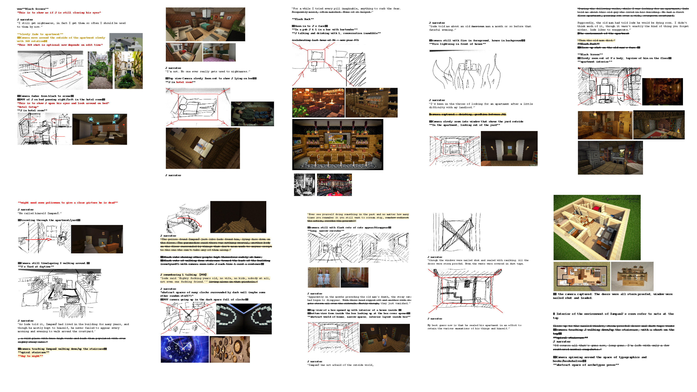
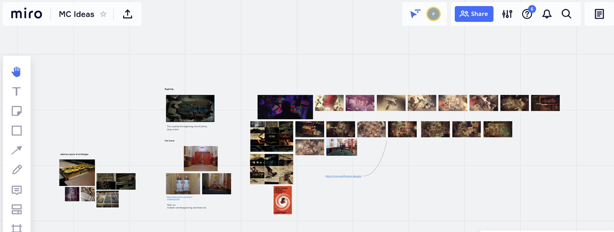
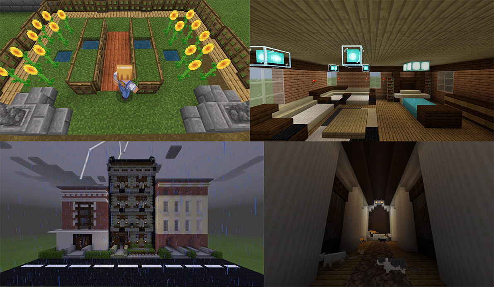
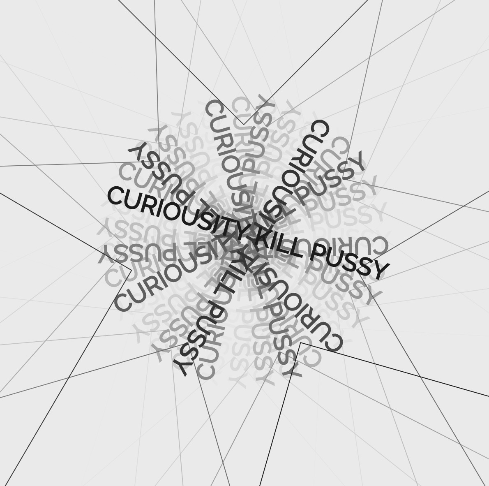

## Assignment 2 : Plan with Storyboard ( Progress )

 

This week, we developed our plan into more dept and better understanding on our google sheet. This week we created our plan with storyboard base on the script and the discussion that we had. This storyboard is very helpful because we have a clearer image of what we are going to do. Also, it helps us to separating the works in the production. For example, what scene we need to build, cinema actions and who is going to be responsible for which part.

To find out more about our Second_Plan please visit this link :

[BestMincraft_Script&Plan](https://docs.google.com/document/d/19jYVR71h8XhRFNsr-k470x9JxL-L0lmXoieETXrT_1o/edit#).

 

We also made a contribution on the online whiteboard platform called “Miro”. This platform we use it to organised our scenes and timelines of how are we going to tell the story. For example, which scenes need to come first, which scenes is unnecessary and necessary and how we can make the flow better. 

To find out more about our Miro_Plan please visit this link :

[BestMincraft_Script&Plan](https://miro.com/app/board/o9J_kngxnTk=/#).

## Assignment 2 : Construction ( Progress )

 

The image above show example of some of the scenes that I have created for our group work. I was uncharged on building; apartments, corridor, rooms and the garden. It was very fun because to build something in Minecraft, especially some unique such as items and materials it requires a lot of tutorials and “How to” to make it possible.  It is also challenging  because we need to build the environment of each scenes in Minecraft to match with the setting in the book. The book describe a lot of details in the building; apartments, corridor, rooms and the garden so we/I tried our best to make it match the story.

## Assignment 2 : Production ( Progress )

Please click on the image, it will direct you to the youtube video (one example) of the scene that I recordered for our project.

Production process, we as a group help to do the record. The process we did here is each one of us will take all the scenes that we have planed to be included in our video, doing it this way help us to have more scene sto choose. This process is very helpful in term of showing individual creativity. Because one person film (record) may be different from another and in this case we have a lot of footages, camera angles and style to choose from. After each of us individually finished the record we sent it to Wen and Faye ( Editors ) who are encharged for putting it all together to finish our outcome

To see more of the records that I filmed for our group please visit this link :

[BestMincraft_Peem_Records](https://drive.google.com/drive/folders/1FOQzDVzEScHNB4rxxPsEGC_hfnaHQmfh?usp=sharing).

## In class : Processing - A practice for spinning-text.

[Play here](https://ptpeem.github.io/EdmCodeWorld/Week_4/Typetest2/)

In the processing workshop, we learnt how to create a spinning-text with using function such as rotate, frameRate, spint+=map and pop. Honestly, I was very stress and panic because it is all new to me but I also found it was challenging and fun to learn about the code language. Karen was saying “ Our brain function like Jazz” while for me “ Coding function like EDM”.

## Extra : Processing - Learning ( the mapping, the object group, variable, mouse press )

Since coding is very new to me, I tried my best to learn the coding language step-by-step from tutorial on Youtube. I then came up with four little exercise to get me going and understanding more on “ HOW TO CODE “. Honestly, it was not easy at all and I was very panic and scared to play around with it. Well people may say “Its not rock as science” but well for me when I was in high school I got a “U=Ungrade” for my science and this doing coding I got the same feeling. 

[Play here](https://ptpeem.github.io/EdmCodeWorld/Week_4/TheMapping/)

[Play here](https://ptpeem.github.io/EdmCodeWorld/Week_4/TheObjectGroupCode/)

[Play here](https://ptpeem.github.io/EdmCodeWorld/Week_4/VariablePractice/)

[Play here](https://ptpeem.github.io/EdmCodeWorld/Week_4/MousePressed/)

  
<a href='https://ptpeem.github.io/EdmCodeWorld/Week_03'> <-- Last Week / Virtual Identities</a> | <a href='https://ptpeem.github.io/EdmCodeWorld/Week_05/'> Next Week / MineCraft Project --></a>

